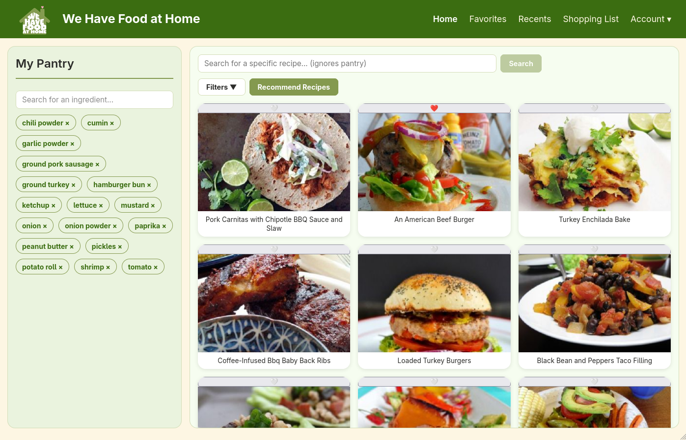
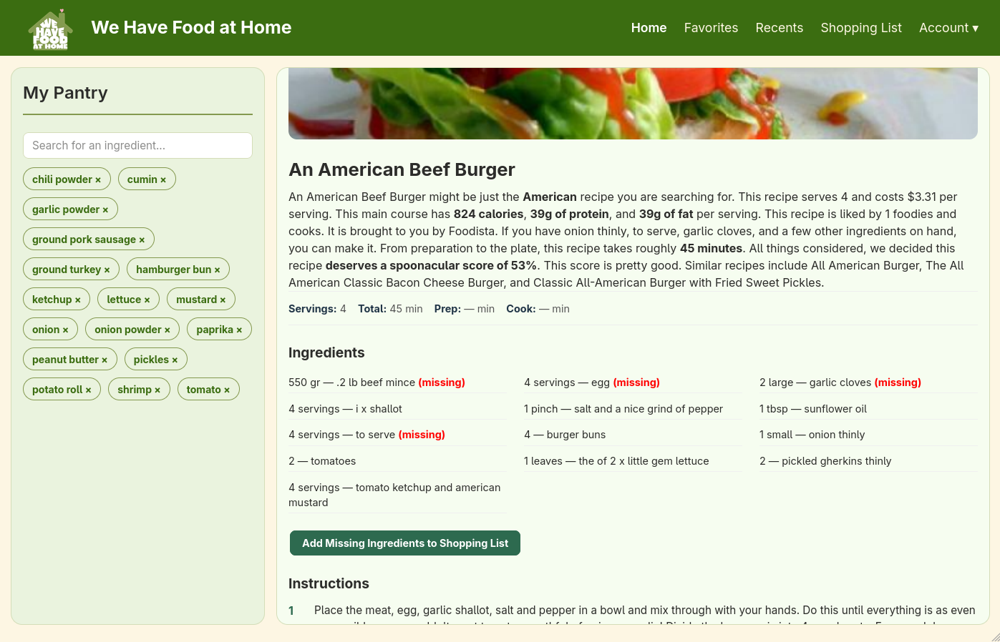
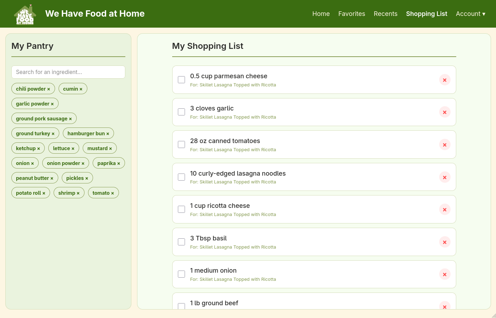

# We Have Food at Home

A web-based recipe recommendation app that helps users plan meals using ingredients they already have, save favorites, generate shopping lists for missing ingredients, and apply dietary preferences to their searches.

**Live demo:** [we-have-food-at-home-8eeae.web.app](https://we-have-food-at-home-8eeae.web.app/)

---

## Features

- **Digital pantry** — track ingredients on hand with autocomplete and persistent storage
- **Recipe recommendations** — pantry-based suggestions ranked by ingredients you already have
- **Recipe search** — search by name when you have something specific in mind
- **Dietary filters** — diets and intolerances applied to every search
- **Saved preferences** — set dietary restrictions once on your account, applied to all searches
- **Favorites** — save recipes for quick access later
- **Shopping list** — auto-generate a list of missing ingredients from any recipe
- **Recently viewed** — see recipes you've recently looked at

---

## Screenshots

### Home / Recipe Search



### Recipe Details



### Shopping List



---

## Tech Stack

- **Frontend:** React 19, Vite, React Router
- **Backend services:** Firebase Authentication, Cloud Firestore
- **Recipe data:** Spoonacular API
- **Deployment:** Firebase Hosting with GitHub Actions CI/CD
- **Other:** DOMPurify, Google OAuth

---

## Getting Started

### Prerequisites

- Node.js 18 or higher
- npm
- A Spoonacular API key ([sign up here](https://spoonacular.com/food-api))
- A Firebase project with Authentication and Firestore enabled

### Setup

1. **Clone the repository**

```bash
git clone https://github.com/drashty-8/We-have-food-at-home.git
cd We-have-food-at-home
```

2. **Install dependencies**

```bash
npm install
```

3. **Configure environment variables**

Copy `.envexample` to `.env` and fill in your keys:

```env
VITE_SPOONACULAR_API_KEY=your_spoonacular_key_here
VITE_FIREBASE_API_KEY=your_firebase_api_key
VITE_FIREBASE_AUTH_DOMAIN=your_project.firebaseapp.com
VITE_FIREBASE_PROJECT_ID=your_project_id
VITE_FIREBASE_STORAGE_BUCKET=your_project.firebasestorage.app
VITE_FIREBASE_MESSAGING_SENDER_ID=your_sender_id
VITE_FIREBASE_APP_ID=your_app_id
```

4. **Run the development server**

```bash
npm run dev
```

The app will be available at `http://localhost:5173`.

5. **Build for production**

```bash
npm run build
```

---

## Project Structure

```plaintext
src/
├── App.jsx               # Root routing
├── main.jsx              # Entry point
├── components/
│   ├── Layout.jsx        # Shared layout: navbar + pantry sidebar
│   ├── NavBar.jsx        # Top navigation with hamburger menu
│   ├── Pantry.jsx        # Ingredient input + chip display
│   ├── Recipes.jsx       # Search/filter UI and recipe grid
│   ├── RecipeCard.jsx    # Single recipe card
│   └── RecipeDetails.jsx # Detailed recipe view
├── pages/
│   ├── Home.jsx          # Search and recipe details swap
│   ├── Account.jsx       # User email, dietary preferences, logout
│   ├── Favorites.jsx     # Saved recipes
│   ├── Recents.jsx       # Recently viewed recipes
│   ├── ShoppingList.jsx  # Missing ingredients list
│   ├── Login.jsx         # Sign in
│   └── Register.jsx      # Create account
├── css/                  # Component stylesheets
├── utils/
│   ├── api.js            # Spoonacular API helpers
│   ├── db.js             # Firestore helpers: pantry, preferences, favorites, etc.
│   └── hooks.js          # Custom React hooks
└── config/
    └── firebase.js       # Firebase configuration
```

---

## Team

Team 8 — COMP 380: Introduction to Software Engineering

- **Julia McElheron** — Scrum Master
- **Itza Flores** — Product Owner
- **Devonte Renshaw** — Test Lead / Developer
- **Drashtybaa Karadia** — Test Engineer / Developer
- **Cindy Quyen** — Test Engineer / Developer

---

## Acknowledgments

- [Spoonacular API](https://spoonacular.com/food-api) for recipe data
- [Firebase](https://firebase.google.com/) for authentication and database
- [React](https://react.dev/) and [Vite](https://vitejs.dev/) for the frontend stack